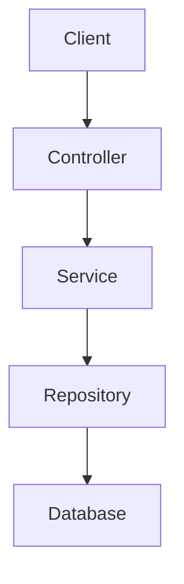
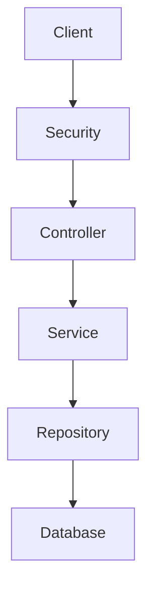
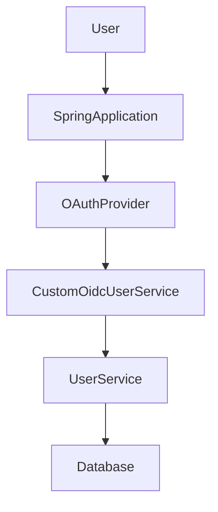

# Spring Framework Learning Repository

A hands-on Java repository covering Spring Framework and Spring Boot concepts through a progressive collection of independent lesson projects, ranging from Spring Core and dependency injection to REST APIs, JPA/Hibernate, transactions, Spring Security, OAuth 2.0/OIDC, JWT authentication, and testing.

---

## 📌 Overview

This repository contains practical implementations created while learning the Spring ecosystem.

Rather than being a single application, the repository is organized into numbered `Lec_*` directories. Most lessons are standalone Maven projects that demonstrate a particular Spring concept or backend development technique.

The learning progression includes:

- Spring Core and Dependency Injection
- Bean Lifecycle
- XML Configuration
- Spring Boot Fundamentals
- REST APIs
- CRUD Operations
- DTOs and Validation
- Exception Handling
- Profiles
- Filters and Interceptors
- Aspect-Oriented Programming (AOP)
- JDBC and Spring JDBC
- Hibernate and JPA
- JPA Entity Relationships
- Spring Data JPA
- Transactions
- Spring Security
- Database Authentication
- Password Encoding
- JWT Authentication
- OAuth 2.0 / OpenID Connect
- Unit and Web Layer Testing

---

## ✨ Features & Topics Covered

### Spring Core

- Spring Application Context
- Dependency Injection
- Bean Configuration
- Bean Lifecycle
- XML-based Spring Configuration

### Spring Boot

- Spring Boot Application Setup
- Maven-based Spring Boot Projects
- REST Controllers
- Request Mapping
- Dependency Injection
- Application Configuration

### REST APIs

The repository contains multiple REST API implementations, including CRUD-based student and product APIs.

Examples include:

- Creating resources
- Reading individual resources
- Reading collections
- Updating resources
- Deleting resources
- Soft deletion
- DTO-based request/response handling
- Request validation
- Exception handling

### Data Access

The repository demonstrates multiple approaches to persistence:

- JDBC
- Spring JDBC
- Hibernate
- JPA
- Spring Data JPA
- MySQL
- SQL Server JDBC support
- JPA entity relationships
- Transaction management

### Security

Security-related lessons cover:

- Spring Security
- Basic authentication
- Database-backed authentication
- BCrypt password encoding
- Stateless security
- JWT authentication
- JWT resource-server configuration
- OAuth 2.0
- OpenID Connect
- Custom OIDC user processing

### AOP

Multiple lessons demonstrate Spring AOP and AspectJ concepts.

### Testing

The testing module demonstrates:

- JUnit 5
- Mockito
- MockMvc
- `@WebMvcTest`
- `@MockitoBean`
- Service-layer unit testing
- Controller-layer testing
- Mocked dependencies
- Interaction verification

---

## 🛠️ Tech Stack

| Category | Technology |
| --- | --- |
| Language | Java |
| Build Tool | Maven |
| Framework | Spring Framework |
| Backend | Spring Boot |
| Web | Spring MVC / WebMVC |
| Persistence | JPA, Hibernate, Spring Data JPA |
| Database | MySQL |
| Database Connectivity | JDBC, MySQL Connector/J, SQL Server JDBC |
| Security | Spring Security |
| Authentication | Database Authentication, JWT |
| OAuth | Spring Security OAuth 2 Client, OIDC |
| AOP | Spring AOP / AspectJ |
| Validation | Jakarta Validation |
| Testing | JUnit 5, Mockito, MockMvc |
| Code Generation | Lombok in selected projects |

The repository contains projects using different Java versions. Later Spring Boot projects generally target Java 25, while earlier projects use Java 17 and Java 21.

---

## 🏗️ Architecture

This repository is not a single application. Each lesson is generally an independent project demonstrating a specific concept.

The REST and persistence examples commonly follow a layered architecture:



For security-based applications:



The OAuth example additionally integrates an external OAuth/OIDC provider:



---

## 📂 Project Structure

```text
Spring-Framework/
├── Lec_1/
│   └── demo/
├── Lec_2/
│   └── demo/
├── Lec_3/
│   └── coredemo/
├── Lec_4/
├── Lec_5/
├── Lec_6/
│   └── bean_lifecycle_demo/
├── Lec_7/
│   └── xml_config_demo/
├── Lec_8/
├── Lec_9/
│   └── DemoApplication/
├── Lec_10/
│   └── CRUDSpringBootDemo/
├── Lec_11/
│   └── crudSpringBootDemoSQL/
├── Lec_12/
│   └── springBootCRUDWithSoftDelete/
├── Lec_13/
│   └── servletCrudDemo/
├── Lec_14/
├── Lec_15/
│   └── CrudDTODemo/
├── Lec_16/
│   └── DtoExceptionHandlingDemo/
├── Lec_17/
│   └── profileDemo/
├── Lec_18/
│   └── filterDemo/
├── Lec_19/
│   └── filterDemoTwo/
├── Lec_20/
│   └── interceptorsDemo/
├── Lec_21/
│   └── AOPDemo/
├── Lec_22/
│   └── AOPDemoTwo/
├── Lec_23/
│   └── AOPDemoThree/
├── Lec_24/
│   └── AOPDemoFour/
├── Lec_25/
│   └── JDBCdemo/
├── Lec_26/
│   └── springJDBCdemo/
├── Lec_27/
│   └── HibernateDemo/
├── Lec_28/
│   └── HibernateInternalsDemo/
├── Lec_29/
│   └── JPARelationships/
├── Lec_30/
│   └── JpaRelationshipDemo/
├── Lec_31/
│   └── SpringDataJPAdemo/
├── Lec_32/
│   └── TransactionDemo/
├── Lec_33/
│   └── TransactionalDemo/
├── Lec_34/
│   └── SpringSecurityDemo/
├── Lec_35/
│   └── SpringSecurityDBAuthAndPasswordSecurity/
├── Lec_36/
│   └── SpringSecurityDBAuthAndPasswordSecurity/
├── Lec_37/
│   └── SpringSecurityDBAuthAndPasswordSecurity/
├── Lec_38/
│   └── OAuthDemo/
├── Lec_39/
│   └── SpringTestingDemo/
├── .gitignore
├── .classpath
├── .project
└── .vscode/
```

---

## 📚 Lesson Roadmap

| Lesson | Project | Main Topic |
| ---: | --- | --- |
| 1 | `demo` | Early Spring/Maven example |
| 2 | `demo` | Persistence/database concepts |
| 3 | `coredemo` | Spring Core |
| 4 | — | Lesson workspace |
| 5 | — | Lesson workspace |
| 6 | `bean_lifecycle_demo` | Bean Lifecycle |
| 7 | `xml_config_demo` | XML Configuration |
| 8 | — | Lesson workspace |
| 9 | `DemoApplication` | Spring Boot Web MVC |
| 10 | `CRUDSpringBootDemo` | CRUD with Spring Boot |
| 11 | `crudSpringBootDemoSQL` | CRUD with SQL |
| 12 | `springBootCRUDWithSoftDelete` | CRUD + Soft Delete |
| 13 | `servletCrudDemo` | Servlet CRUD |
| 14 | — | Lesson workspace |
| 15 | `CrudDTODemo` | DTO + Validation |
| 16 | `DtoExceptionHandlingDemo` | DTO + Exception Handling |
| 17 | `profileDemo` | Spring Profiles |
| 18 | `filterDemo` | Servlet Filters |
| 19 | `filterDemoTwo` | Filters |
| 20 | `interceptorsDemo` | Spring MVC Interceptors |
| 21 | `AOPDemo` | AOP |
| 22 | `AOPDemoTwo` | AOP / AspectJ |
| 23 | `AOPDemoThree` | AOP / AspectJ |
| 24 | `AOPDemoFour` | AOP |
| 25 | `JDBCdemo` | JDBC |
| 26 | `springJDBCdemo` | Spring JDBC |
| 27 | `HibernateDemo` | Hibernate / JPA |
| 28 | `HibernateInternalsDemo` | Hibernate Internals |
| 29 | `JPARelationships` | JPA Relationships |
| 30 | `JpaRelationshipDemo` | JPA Relationships |
| 31 | `SpringDataJPAdemo` | Spring Data JPA |
| 32 | `TransactionDemo` | Transactions |
| 33 | `TransactionalDemo` | `@Transactional` |
| 34 | `SpringSecurityDemo` | Spring Security |
| 35 | `SpringSecurityDBAuthAndPasswordSecurity` | Database Authentication |
| 36 | `SpringSecurityDBAuthAndPasswordSecurity` | Security |
| 37 | `SpringSecurityDBAuthAndPasswordSecurity` | JWT Security |
| 38 | `OAuthDemo` | OAuth 2.0 / OIDC |
| 39 | `SpringTestingDemo` | JUnit + Mockito + MockMvc |

---

## 🚀 Getting Started

Because the repository contains multiple independent Maven projects, run a specific lesson rather than attempting to start the repository root as one application.

### Prerequisites

Depending on the lesson:

- Java
- Maven
- MySQL for database-backed projects
- OAuth credentials for the OAuth project

An IDE such as IntelliJ IDEA, Eclipse, or VS Code can be used but is not required.

### Java Versions

Different lessons use different Java versions.

Before running a lesson, check its `pom.xml` for the configured Java version.

---

## 📥 Installation

Clone the repository:

```bash
git clone https://github.com/gautamaggarwaldev/Spring-Framework.git
cd Spring-Framework
```

Navigate to a specific lesson:

```bash
cd Lec_39/SpringTestingDemo
```

Build the project:

```bash
mvn clean install
```

Run tests:

```bash
mvn test
```

For Spring Boot projects:

```bash
mvn spring-boot:run
```

---

## ⚙️ Configuration

Several projects use `application.properties` for configuration.

### Database Configuration

Database-backed projects use configuration similar to:

```properties
spring.datasource.url=jdbc:mysql://localhost:3306/<database>
spring.datasource.username=<username>
spring.datasource.password=<password>

spring.jpa.hibernate.ddl-auto=update
spring.jpa.show-sql=true
spring.jpa.properties.hibernate.format_sql=true
```

Create the required MySQL database before running the relevant application.

### OAuth Configuration

The OAuth project requires Google OAuth/OIDC credentials.

Example:

```properties
spring.security.oauth2.client.registration.google.client-id=${CLIENT_ID}
spring.security.oauth2.client.registration.google.client-secret=${CLIENT_SECRET}
spring.security.oauth2.client.registration.google.scope=openid,profile,email
```

Set the required credentials in your environment instead of committing them to Git.

### JWT Configuration

The JWT project requires configuration similar to:

```properties
jwt.secret=<your-secret>
jwt.issuer=<your-issuer>
jwt.expiry=<expiry>
```

Use a secure, newly generated secret for your own environment.

---

## 🔐 Security Notice

Some lesson configuration files contain database credentials and security-related secrets.

Before publishing, deploying, or reusing the projects:

- Remove hard-coded credentials.
- Rotate any exposed secrets.
- Use environment variables.
- Do not commit API keys or passwords.
- Do not reuse development secrets in production.

Recommended configuration:

```properties
spring.datasource.username=${DB_USERNAME}
spring.datasource.password=${DB_PASSWORD}

spring.security.oauth2.client.registration.google.client-id=${CLIENT_ID}
spring.security.oauth2.client.registration.google.client-secret=${CLIENT_SECRET}

jwt.secret=${JWT_SECRET}
```

---

# 🔌 API Documentation

The repository contains multiple independent APIs.

These endpoints belong to individual lessons and are not part of one unified API.

## Student CRUD — `Lec_12`

Base path:

```text
/api/students
```

| Method | Endpoint | Description |
| --- | --- | --- |
| `POST` | `/api/students/create` | Create a student |
| `GET` | `/api/students/get?id={id}` | Get a student |
| `GET` | `/api/students/getAll` | Get all students |
| `PUT` | `/api/students/update?id={id}` | Update a student |
| `DELETE` | `/api/students/delete?id={id}` | Delete a student |
| `PATCH` | `/api/students/delete-soft?id={id}` | Soft-delete a student |

---

## Student CRUD with DTOs — `Lec_15`

Base path:

```text
/api/students
```

| Method | Endpoint | Description |
| --- | --- | --- |
| `POST` | `/api/students/create` | Create a student |
| `GET` | `/api/students/get?id={id}` | Get a student |
| `GET` | `/api/students/getAll` | Get all students |
| `PUT` | `/api/students/update?id={id}` | Update a student |
| `DELETE` | `/api/students/delete?id={id}` | Delete a student |
| `PATCH` | `/api/students/delete-soft?id={id}` | Soft-delete a student |

---

## Student CRUD with Exception Handling — `Lec_16`

Base path:

```text
/api/students
```

| Method | Endpoint | Description |
| --- | --- | --- |
| `POST` | `/api/students` | Create a student |
| `GET` | `/api/students/{id}` | Get a student |
| `GET` | `/api/students` | Get all students |
| `PUT` | `/api/students?id={id}` | Update a student |
| `DELETE` | `/api/students?id={id}` | Delete a student |
| `PATCH` | `/api/students/delete-soft?id={id}` | Soft-delete a student |

---

## Product API — `Lec_39`

Base path:

```text
/api/products
```

| Method | Endpoint | Description |
| --- | --- | --- |
| `GET` | `/api/products/{id}` | Retrieve a product |
| `POST` | `/api/products` | Create a product |

---

## Authentication API — `Lec_37`

### Login

```http
POST /auth/login
```

Returns a JWT after successful authentication.

### User Registration

```http
POST /api/users/register
```

### Authenticated Endpoint

```http
GET /api/users/hello
```

---

# 🗄️ Database

The database-backed projects primarily use **MySQL**.

Database-related lessons include:

- JDBC
- Spring JDBC
- Hibernate
- JPA
- JPA relationships
- Spring Data JPA
- Transactions
- Database-backed Spring Security
- OAuth user persistence

Example configuration:

```properties
spring.datasource.url=jdbc:mysql://localhost:3306/<database>
spring.datasource.username=<username>
spring.datasource.password=<password>
```

Some projects use:

```properties
spring.jpa.hibernate.ddl-auto=update
```

Each lesson has its own database configuration and entities.

There is no single database schema shared by the entire repository.

---

# 🔐 Authentication & Authorization

The repository progressively demonstrates Spring Security.

## Basic Spring Security

The security lessons demonstrate Spring Security configuration for protected application endpoints.

## Database Authentication

The database authentication projects use:

- Spring Security
- Spring Data JPA
- MySQL
- Custom `UserDetailsService`
- BCrypt password encoding
- `DaoAuthenticationProvider`

## JWT

The JWT security implementation includes:

- Stateless authentication
- `AuthenticationManager`
- `DaoAuthenticationProvider`
- BCrypt
- JWT encoder
- JWT decoder
- HS256
- JWT authorities
- OAuth2 Resource Server

## OAuth 2.0 / OpenID Connect

The OAuth project uses Google OAuth/OIDC.

Configured scopes include:

```text
openid
profile
email
```

The application also contains a custom OIDC user service for processing authenticated users.

---

# 🧪 Testing

The repository contains a dedicated testing project:

```text
Lec_39/SpringTestingDemo
```

Testing technologies include:

- JUnit 5
- Mockito
- MockMvc
- `@WebMvcTest`
- `@MockitoBean`
- Service-layer unit tests
- Controller-layer tests

### Run Tests

```bash
cd Lec_39/SpringTestingDemo
mvn test
```

The tests cover controller behavior, service behavior, repository interactions, HTTP responses, and exception scenarios.

---

# 🐳 Docker

Docker configuration was not identified in the repository.

Therefore, Docker commands are intentionally not included as supported setup instructions.

---

# 🚀 Deployment

The repository is primarily structured as a collection of Spring learning projects.

No verified deployment configuration for platforms such as AWS, Azure, Render, Railway, or other hosting providers was identified.

Therefore, deployment instructions are not included.

---

# 📋 Maven Commands

Run Maven commands from the directory containing the relevant `pom.xml`.

### Compile

```bash
mvn compile
```

### Run Tests

```bash
mvn test
```

### Clean and Build

```bash
mvn clean install
```

### Package

```bash
mvn package
```

### Run Spring Boot

```bash
mvn spring-boot:run
```

The `spring-boot:run` command applies only to projects configured as Spring Boot applications.

---

# 🧭 Learning Roadmap

The repository follows a progressive learning path:

```text
Spring Core
    ↓
Dependency Injection
    ↓
Beans & Bean Lifecycle
    ↓
XML Configuration
    ↓
Spring Boot
    ↓
REST APIs
    ↓
CRUD
    ↓
DTOs & Validation
    ↓
Exception Handling
    ↓
Profiles
    ↓
Filters & Interceptors
    ↓
AOP
    ↓
JDBC
    ↓
Spring JDBC
    ↓
Hibernate
    ↓
JPA
    ↓
JPA Relationships
    ↓
Spring Data JPA
    ↓
Transactions
    ↓
Spring Security
    ↓
Database Authentication
    ↓
JWT
    ↓
OAuth 2.0 / OIDC
    ↓
Testing
```

---

# 🔮 Future Improvements

The following are suggestions for improving the repository and are **not currently implemented features**:

- Add a root-level learning roadmap with direct links to each lesson.
- Add README files inside major lesson directories.
- Standardize Java versions where practical.
- Externalize database credentials and security secrets.
- Add `.env.example` or configuration templates.
- Rotate credentials and secrets that have already been committed.
- Add automated tests to more lesson projects.
- Add curl/Postman examples for REST APIs.
- Add database setup scripts.
- Add GitHub Actions for Maven builds and tests.
- Add a dedicated contribution guide.
- Add screenshots for lessons where visual output is useful.

---

# 🤝 Contributing

Contributions are welcome.

### Workflow

1. Fork the repository.
2. Create a feature branch.

```bash
git checkout -b feature/your-feature
```

3. Make your changes.
4. Run the relevant tests.

```bash
mvn test
```

5. Commit your changes.

```bash
git add .
git commit -m "Add your change"
```

6. Push the branch.

```bash
git push origin feature/your-feature
```

7. Open a Pull Request.

When contributing, keep individual lessons focused on their respective Spring concepts.

---

# 📄 License

No license has currently been specified for this repository.

---

# 👨‍💻 Author

**Gautam Aggarwal**

GitHub: [@gautamaggarwaldev](https://github.com/gautamaggarwaldev)

---

## 📌 Repository

[Spring-Framework](https://github.com/gautamaggarwaldev/Spring-Framework)

A practical collection of Spring Framework and Spring Boot lessons progressing from fundamentals to REST APIs, persistence, security, OAuth/OIDC, and automated testing.
